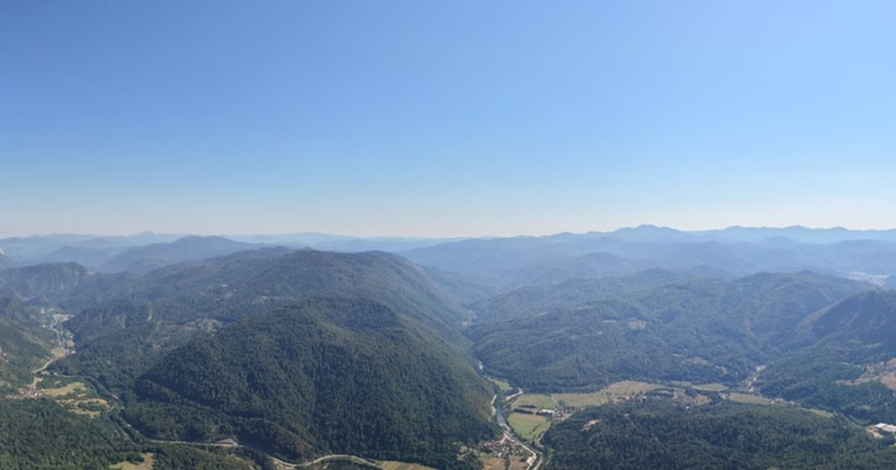

<p align="center">
  
</p>

<h1 align="center">dji-360</h1>

<p align="center">
  A personal archive of 360° aerial panoramas, shot on DJI drones.
</p>

<p align="center">
  <a href="https://deploy.workers.cloudflare.com/?url=https://github.com/dz0ny/dji-360"></a>
</p>

<p align="center">
  
  
  
  
</p>

dji-360 is the site behind [dji.dz0ny.dev](https://dji.dz0ny.dev). Drop a
stitched equirectangular panorama into the upload page and it becomes a card in
the gallery and a sphere you can drag, pinch, or tilt your phone to look
around — with the location shown on a minimap built from the coordinates the
drone recorded.

There is no database, no image pipeline, and no server-side processing. One R2
bucket holds the pixels *and* the metadata; the browser produces every
derivative before anything leaves the device; the Worker only hands bytes back.

## Preview

<p align="center">
  
</p>

## Why it exists

Panorama hosting usually means handing full-resolution originals to a service
that re-encodes them, watermarks the viewer, and eventually changes its terms.
The photographs here are the point, so the archive keeps them at capture
resolution in storage the owner controls, and spends its complexity budget on
the one thing that actually matters on a phone: a sphere that loads fast, reads
clearly, and lets you go back to the full-resolution frame when you want to.

The result is small enough to understand in an afternoon — five pages, one
Worker with two routes, one bucket.

## Highlights

- Drag, pinch, or tilt to look around; gyroscope on mobile, autorotate on the hero
- Minimap showing where the frame was taken, stitched from OpenStreetMap tiles in the browser — no map API key
- Quality switch between a 4096px preview texture and the full-resolution original
- Every derivative is generated **client-side** from a single decode before upload
- A 1200×630 social card per panorama, cropped to a 110° slice of the horizon rather than the whole squashed sphere
- Three complete themes — Dark Room, Flight Log, Paper Sky — switchable at runtime and applied before first paint
- Uploads gated by Cloudflare Access; the public gallery API stays public
- One R2 bucket, auto-provisioned on first deploy. No KV, no D1, no queue

## Feature Overview

| Area | What you get |
|---|---|
| Gallery | Asymmetric grid where the newest frame and every seventh card span double width, revealed on scroll |
| Viewer | Photo Sphere Viewer 5 with the gyroscope, autorotate, map, settings, and resolution plugins |
| Location | A 3×3 OpenStreetMap tile grid composed onto a canvas at view time, with the pin and view cone drawn by the map plugin |
| Quality | 4K preview by default; the full-resolution WebP archive one tap away, with its size shown before you commit to it |
| Upload | Drag a stitched JPEG in; the browser decodes once and writes four derivatives, cover → preview → original → thumb |
| Social cards | Each upload stores a 1200×630 horizon crop at `/~/img/cover/<id>`, ready for link previews |
| Themes | Dark / Log / Paper switch in the header, persisted to `localStorage`, re-applied by an inline head script |
| Access control | `GET /~/api/photos` is public; every mutation verifies the Cloudflare Access JWT itself |
| Agent readiness | `llms.txt`, `robots.txt`, `Content-Signal` preferences, and JSON-LD on every page |

## How it works

1. You pick a stitched equirectangular JPEG — 12000×6000 and 30–50 MB is typical.
2. The browser decodes it **once** and draws that bitmap down into four sizes:
   a full-resolution WebP archive (same pixels, roughly a third of the bytes), a
   4096×2048 sphere texture, a 1200×630 social card, and an 800px thumb.
3. Each derivative is PUT to R2 in the order cover → preview → original → thumb,
   so an interrupted upload leaves orphan bytes rather than a broken card.
4. All metadata — title, date, coordinates, camera, byte count — is written to
   the **thumb** object's `customMetadata`. Thumbs are tens of kilobytes, so
   editing a title is a cheap re-put.
5. The gallery renders from a single `list({ prefix: 'thumbs/' })`. That is the
   whole database.

The Worker never touches a pixel. It lists, streams, and checks a JWT.

## Stack

Astro 6 · Tailwind CSS v4 · Photo Sphere Viewer 5 · shadcn/ui · TypeScript · Biome · Bun · Cloudflare Workers · R2

## Deploy your own

[](https://deploy.workers.cloudflare.com/?url=https://github.com/dz0ny/dji-360)

The button clones this repository into your own GitHub account, provisions the
R2 bucket the `PHOTOS` binding asks for, wires up Workers Builds, and deploys.
`wrangler.toml` deliberately omits `bucket_name` so the bucket is created and
linked for you.

Three things in `wrangler.toml` are specific to this deployment and want
changing before yours is useful:

```toml
name = 'dji-360'              # your Worker name

[[routes]]
pattern = "dji.dz0ny.dev"     # your domain — or delete this block and use the
custom_domain = true          # workers.dev URL

[vars]
ACCESS_TEAM_DOMAIN = "…"      # your Cloudflare Access team domain
ACCESS_AUD = "…"              # the AUD tag of your own Access application
```

Until `ACCESS_AUD` points at an Access application you control, `/admin` is not
protected by anything you own — set it up before uploading. Gallery reads stay
public by design; every write is verified against that JWT.

## Develop

```sh
bun install
bun run dev
```

`bun run dev` builds the site and runs the **real Worker** under `wrangler dev`
with a local R2 — one implementation, one route table, identical to production.
The only local difference is `ACCESS_DEV_BYPASS=1` in `.dev.vars` (never
uploaded by `wrangler deploy`), standing in for the Access layer that only
exists in front of the live domain.

```sh
bun run build     # → dist/client/
bun run check     # astro type-check
bun run lint      # biome
bun run og        # regenerate public/og.jpg from the sample panorama
bun run deploy    # build + wrangler deploy
```

> The Cloudflare adapter writes a redirected config at `dist/client/wrangler.json`
> and `.wrangler/deploy/config.json` during build. For this static-assets +
> custom-worker setup that generated config omits `main`, so a bare
> `wrangler deploy` picking it up would skip `worker/index.js` entirely. Every
> build script removes both files so the authoritative root `wrangler.toml`
> always wins.

### Optional: devenv

`devenv.nix`, `devenv.yaml`, and `.envrc` declare `bun` and `wrangler` via
[devenv](https://devenv.sh). Not using it? Delete all three — nothing else
depends on them.

## Layout

```text
src/pages/          index · view · admin · branding · 404
src/components/     PanoViewer.astro (the sphere and all its chrome)
src/lib/staticmap   OpenStreetMap tile grid → one canvas image for the minimap
src/index.css       every design token, all three themes
worker/photos.js    the JSON API and image delivery
worker/access.js    Cloudflare Access JWT verification
wrangler.toml       routes, bindings, and the run_worker_first split
```

`run_worker_first = ["/~*"]` is the whole routing story: `/~/*` reaches the
Worker, everything else is served straight from `dist/client/` by Cloudflare's
asset layer and never enters Worker code.

## Working with Claude

`CLAUDE.md` at the repo root carries the agent spec, and
`site-specification.md` records the design decisions — palette, type, motion
dials, and why each one was chosen. Both are meant to be read before changing
anything visual.
